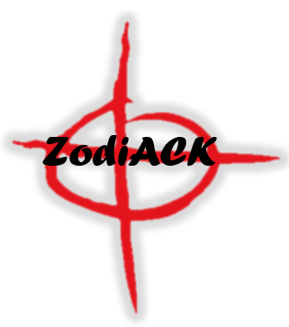

<!-- PROJECT SHIELDS -->
[![Contributors][contributors-shield]][contributors-url]
[![Forks][forks-shield]][forks-url]
[![Stargazers][stars-shield]][stars-url]
[![Issues][issues-shield]][issues-url]


<!-- PROJECT LOGO -->
<br />
<div align="center">
  <a href="https://github.com/ProjectZodiACK/project">
    
  </a>

  <h3 align="center">ProjectZodiACK</h3>

  <p align="center">
    An IST 440W FA22 Project
    <br />
    <br />
    <a href="https://zodiack.tk">View Demo</a>
    ·
    <a href="https://github.com/ProjectZodiack/project/issues">Report Bug</a>
    ·
    <a href="https://github.com/ProjectZodiack/project/issues">Request Feature</a>
  </p>
</div>


<!-- TABLE OF CONTENTS -->
<details>
  <summary>Table of Contents</summary>
  <ol>
    <li><a href="#about-the-project">About The Project</a></li>
    <li>
      <a href="#getting-started">Getting Started</a>
      <ul>
        <li><a href="#prerequisites">Prerequisites</a></li>
        <li><a href="#installation">Installation</a></li>
        <li><a href="#usage">Usage</a></li>
      </ul>
    </li>
    <li><a href="#roadmap">Roadmap</a></li>
    <li><a href="#contributing">Contributing</a></li>
    <li><a href="#acknowledgments">Acknowledgments</a></li>
  </ol>
</details>


<!-- ABOUT THE PROJECT -->
## About The Project

This code is part of an integration project for Penn State's IST 440W capstone course. The code is heavily modified to perform optical character recognition (OCR) on a handwritten note, decrypted using three brute force methods, and then translated into three languages.


<!-- GETTING STARTED -->
## Getting Started

It is recommended to put this solution behind proper authentication before deploying in a production environment. In our demo instance, we used a Caddy webserver with the Caddy Security module to proxy to the Flask instance.

### Prerequisites

* <a href="https://www.python.org/downloads/">Python</a> and <a href="https://tesseract-ocr.github.io/tessdoc/Downloads.html">Tesseract</a> must be installed on the machine. 
* The following command will install the requirements to run our code via pip.

  ```sh
  pip install -r requirements.txt
  ```

### Installation

1. Clone the repository

   ```sh
   git clone https://github.com/ProjectZodiACK/project.git
   ```
2. Run `app.py`

   ```sh
   python app.py
   ```
   
### Usage

Traverse to http://localhost:5000.

<p align="right">(<a href="#readme-top">back to top</a>)</p>


<!-- ROADMAP -->
## Roadmap

- [x] Handwritten OCR
- [x] Decryption
    - [x] Vigenére Cipher
    - [x] Caesar Cipher
    - [x] Solitaire Cipher
- [x] Translation
    - [x] English
    - [x] Spanish
    - [x] French
- [x] Logging
- [x] File Explorer
- [x] Caddy Web Server (demo)
- [x] Caddy Security (demo) 

See the [open issues](https://github.com/ProjectZodiack/project/issues) for a full list of proposed features (and known issues).

<p align="right">(<a href="#readme-top">back to top</a>)</p>


<!-- CONTRIBUTING -->
## Contributing

Contributions are what make the open source community such an amazing place to learn, inspire, and create. Any contributions you make are **greatly appreciated**.

If you have a suggestion that would make this better, please fork the repo and create a pull request. You can also simply open an issue with the tag "enhancement".
Don't forget to give the project a star! Thanks again!

1. Fork the Project
2. Create your Feature Branch (`git checkout -b feature/AmazingFeature`)
3. Commit your Changes (`git commit -m 'Add some AmazingFeature'`)
4. Push to the Branch (`git push origin feature/AmazingFeature`)
5. Open a Pull Request

<p align="right">(<a href="#readme-top">back to top</a>)</p>


<!-- ACKNOWLEDGMENTS -->
## Acknowledgments

Use this space to list resources you find helpful and would like to give credit to. I've included a few of my favorites to kick things off!

### Team 1 Members
* Caitlin Sullivan
* Aaron Strohm
* Sean Walsh

### Resources
* [Caddy Server](https://github.com/caddyserver/)
* [Caddy Security](https://github.com/greenpau/caddy-security/)
* [OCR Tesseract Docker](https://github.com/ricktorzynski/ocr-tesseract-docker)
* [Caesar Cipher](https://github.com/ObeidaElJundi/caesarHacker)
* [Vigenére Cipher](https://github.com/MateuszLenczewski/Vigenere-code-brute-forcedecryption)
* [Solitaire Cipher](https://github.com/fmurer/solitaire_decrypter)
* [TextBlob](https://github.com/sloria/TextBlob)
* [Loguru](https://github.com/Delgan/loguru)
* [README Template](https://github.com/othneildrew/Best-README-Template)

<p align="right">(<a href="#readme-top">back to top</a>)</p>


<!-- MARKDOWN LINKS & IMAGES -->
<!-- https://www.markdownguide.org/basic-syntax/#reference-style-links -->
[contributors-shield]: https://img.shields.io/github/contributors/ProjectZodiack/project.svg?style=for-the-badge
[contributors-url]: https://github.com/ProjectZodiack/project/graphs/contributors
[forks-shield]: https://img.shields.io/github/forks/ProjectZodiack/project.svg?style=for-the-badge
[forks-url]: https://github.com/ProjectZodiack/project/network/members
[stars-shield]: https://img.shields.io/github/stars/ProjectZodiack/project.svg?style=for-the-badge
[stars-url]: https://github.com/ProjectZodiack/project/stargazers
[issues-shield]: https://img.shields.io/github/issues/ProjectZodiack/project.svg?style=for-the-badge
[issues-url]: https://github.com/ProjectZodiack/project/issues
[license-shield]: https://img.shields.io/github/license/ProjectZodiack/project.svg?style=for-the-badge
[license-url]: https://github.com/ProjectZodiack/project/blob/master/LICENSE.txt
[linkedin-shield]: https://img.shields.io/badge/-LinkedIn-black.svg?style=for-the-badge&logo=linkedin&colorB=555
[linkedin-url]: https://linkedin.com/in/othneildrew
